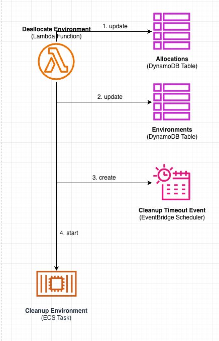

# CDK Test Envirnoment Allocation Service | Atmosphere

## Glossary

* **Environment:** A combination of an AWS account and region, where resources can be deployed to.
* **Integration Test:** A single execution instance of a test. Two executions (even if parallel) are considered two distinct integration tests.
* **Stage:** Where in the [SDLC](https://aws.amazon.com/what-is/sdlc/) is the integration test executed in. (e.g `release`, `canary`)

## High Level Overview

We will provide a publicly accessible HTTP service that manages a collection of pre-existing
environments and allocates them to integration tests per request. Once the integration test
relinquishes the environment, the service will perform cleanup and reinstate it for addition
allocation requests. Timeouts will be imposed to make sure integration tests don’t hold an
environment for an undetermined period of time.

While the service is publicly available, it will not allow anonymous access. During service deployment,
an operator will configure a list of accounts that will have access to the service. These are the
accounts that test runners will be executed in. (note: these are not the target accounts
where test resources are deployed to).

### Registration

Registration is the process of adding capacity to the system. Before an environment can
be allocated to an integration test, it must first be registered with the service.
Registration is a manual process that involves:

1. Creating an AWS account.
2. Creating an Admin Role that the service can assume to offer temporary credentials.
3. Manually provisioning any desired resources in the account.
4. Manually pushing a configuration update to the service codebase.
5. Deploying the service.

Environments are placed inside pools, where each pool contains a distinct set of environments.
When integration tests issue an allocation request, they also specify which pool to allocate from.
This allows for creating reserved capacity for specific stages or use cases.

### Allocation

Whenever an integration test requires an environment, it issues an environment allocation request
to the service. Most commonly,  allocations will consist of a single standard environment.
However, custom allocations are also supported in order to cater for tests with specific needs:

* Tests that require multiple accounts.
* Tests that require specific resources to be available in an environment.
* Tests that require specific authentication credentials.

Based on the request query, the service will discover available environments and provide the
test with authentication information for each environment, along with its metadata. In case no
environments are available, the service will respond with an error, signaling the integration
test should try again later. Environments allocated to a specific test will be marked as
unavailable until the same test issues an environment deallocation request. This prevents test
interference regardless of where the test is executed from.

Environments are allocated for a fixed session duration of 3 hours. When the session expires,
the service will regain control of the allocated environments by explicitly issuing a deallocation
request on behalf of the integration test.

### Deallocation

Whenever an integration test finishes execution, whether it failed or succeeded, it must
issue an environment deallocation request. Upon receiving such a request, the service begins
cleaning up the environment. In order to guarantee tests are unable to create resources after
they have relinquished their environments, the service also deactivates all provided credentials.

Once cleanup completes successfully, the environment is marked as available and reinstated back
to the list of available environments. This ensures tests are given a fresh environment,
further ensuring no tests interfere with each other. In case of a cleanup failure or timeout,
the environment will be marked as “dirty” and will require human intervention before it can be reinstated.

### De-registration

De-registration is the process of removing capacity to the system. It can occur either
because a specific environment is no longer needed, or because it requires human maintenance.
It consists of:

1. Manually pushing a configuration update to the service codebase.
2. Deploying the service.

Before an environment can be de-registered, it must first be deallocated, as it may be currently in use.
Therefore, de-registration is an asynchronous process; the environment is first marked as deregistered to
prevent future allocations, and then deallocated in the background once the current allocation expires.
Operators can query system state to determine when de-registration has fully completed.

## Detailed Architecture

### Components Diagram

The following diagram describes all components involved in the functional behavior of the proposed service.
Arrows correspond to the direction of access.


### Config Layer

Configuration will be stored in a `configuration.json` file inside a dedicated S3 bucket.
Logical components that need access to it may download it from the bucket whenever they need to.

#### `Environments`

Environments are registered and de-registered from the service via a configuration option of the service construct.
They will be stored inside the `environments` key of the configuration file. It contains a list of all
possible environments that the service can select for allocation.

> Note: In order to allocate an environment, it must be both registered and not allocated.

Each environment must be assigned to a specific pool; pools correspond to the various stages integration tests are running in. When tests request an environment, they must specify which pool it should be allocated from. This ensures that different stages cannot interfere with each other. The number of registered environments per pool determines the parallelism limit of of the corresponding stage.

Each environment can expose certain optional capabilities that are recorded in the configuration file. These allow catering for integration tests that require a non standard environment. Capabilities are dynamic and can vary greatly across environments.

> For example, a capability could be providing a hosted zone with a hosted_zone_name attribute.

**Registration consists of:**

1. Creating an AWS account.
2. Creating an Admin Role that the service can assume to offer temporary credentials.
3. Manually provisioning any desired resources in the account.
4. Adding a record to the service configuration.
5. Deploying the service.

**De-registration consists of:**

1. Removing a record from the service configuration.
2. Deploying the service.

**Schema:**

```yaml
# the account id of the environment
account: string | required

# the region of the environment
region: string | required

# which pool this environment belongs to.
# should correspond to an integration test stage
pool: string | required

# Arn of an Admin role that the service
# has permissions to.
admin_role: string | required
  
# dynamic properties that expose environment 
# specific capabilities
capabilities: {string, any} | optional
```

### Api Layer

Api Gateway will provide the public HTTP endpoint for clients to interact with. Requests are routed to
individual lambda functions using the Lambda Proxy Integration. In addition, the endpoint will handle
authentication and authorization.

#### Routes

* `POST /allocations` → [Allocation (Lambda Function)](#allocation-lambda-function).
* `DELETE /allocations/{id}` → [Deallocation (Lambda Function)](#deallocation-lambda-function)


#### Authentication & Authorization

While the service is accessible over the public internet, it will reject anonymous user access.
A [resource policy](https://docs.aws.amazon.com/apigateway/latest/developerguide/apigateway-authorization-flow.html#apigateway-authorization-flow-resource-policy-only) on the API,
in conjunction with [AWS_IAM authentication](https://docs.aws.amazon.com/apigateway/latest/developerguide/apigateway-authorization-flow.html#apigateway-authorization-flow-iam) on its methods,
will ensure that access is allowed only to authenticated AWS users who have permissions to invoke its various routes. This requires HTTP clients to sign their
request with [AWS Signature V4](https://docs.aws.amazon.com/AmazonS3/latest/API/sig-v4-authenticating-requests.html).

* During service deployment, authorized AWS accounts will be added to an [account allow list](https://docs.aws.amazon.com/apigateway/latest/developerguide/apigateway-resource-policies-examples.html#apigateway-resource-policies-cross-account-example),
which will be used in the resource policy.
* Authorized accounts must access the service using a role that allows the `execute-api:Invoke` action on the API. We recommend attaching
the [`AmazonAPIGatewayInvokeFullAccess`](https://docs.aws.amazon.com/aws-managed-policy/latest/reference/AmazonAPIGatewayInvokeFullAccess.html) managed policiy to
any role that needs access to the service.

### Storage Layer

All service state will be stored in DynamoDB regional tables.

* [Point-in-time backups](https://docs.aws.amazon.com/amazondynamodb/latest/developerguide/Point-in-time-recovery.html) enable full disaster recovery.
* [Secondary indexes](https://docs.aws.amazon.com/amazondynamodb/latest/developerguide/HowItWorks.CoreComponents.html) will allow for increased query performance in case of bottlenecks.
* [On-demand Capacity](https://docs.aws.amazon.com/amazondynamodb/latest/developerguide/on-demand-capacity-mode.html) will accommodate throughput requirements.

> Note: DynamoDB has a default quota of 20 secondary indexes per table, which should be plenty for us, though an increase request is also possible.

**Data Sizes:**

* DynamoDB has a maximum item size of 400KB. Our items will not exceed that.
* DynamoDB slices table data into 10GB sized partitions. If the data grows larger than that, it will automatically split the data into more and more partitions. Having multiple partitions requires careful partition planning as it has implications on performance and cost. We will not require that as our table data is not expected to grow beyond 10GB.

#### `Environments (DynamoDB Table)`

A list of registered environments and their runtime state. It is used to determine whether an environment
is available for allocation. The service starts with an empty table, and maintains it during its
operation.

* When an environment is acquired, it is added to the table along with the allocation that acquired it.
* When an environment is released, it is removed from the table.

Rows are uniquely identified by the account + region primary key.

**Schema:**

```yaml
# the account id of the environment
account: string | required

# the region of the environment
region: string | required

# cleaning - the environment is current being cleaned.
# in-use - the environment is not available for allocation.
# dirty - cleanup failed. requires human attention.
status: string | required

# which allocation currently holds this environment, 
# regardless of state. remember that if an environment is free, 
# it doesn't exist as an item in the table.
allocation: string | required
```

**Access Patterns:**

* Runtime insertion when an environment is allocated.
* Runtime updates when an environment is being cleaned.
* Runtime deletion of rows when an environment deallocated.

Secondary indexes are not needed because all access is done using the primary key. No scans required.

#### `Allocations (DynamoDB Table)`

A list of allocations. An allocation is an assignment of a single environment to a specific integration test.
If an integration test requires N environments, N allocations will be created.  Rows are uniquely identifier
by an allocation id, which serves as the primary key.

**Historical Data:**

In order to troubleshoot environment problems, we would like to retain historical allocations data in easily
queryable form. It would allow us to answer questions like:

* Which integration tests acquired environment E in the past X months?
* Which environments were acquired by integration test T in the past X months?

We will retain allocations for a period of 6 months.

**Schema:**

```yaml
# auto generated 36 character GUID.
id: string | required

# the account id of the allocated environment
account: string | required

# the region of the allocated environment
region: string | required

# the pool the environment belongs to.
pool: string | required

# who created the allocation. 
# controlled by the integration test. 
# max 1024 chars.
requester: string | required

# when did the allocation start (ISO-8601)
start: string | required

# when did the allocation end (ISO-8601)
end: string | required

# what was the outcome of the allocation. 
# controlled by the integration test
outcome: string | optional
```

**Access Patterns:**

* Runtime insertion following an allocation request.
* Runtime lookup of account and region based on primary key.
* Automatic row deletion using a [TTL](https://docs.aws.amazon.com/amazondynamodb/latest/developerguide/TTL.html).

Secondary indexes are not needed because table scans are not performed and updates always use the primary key.

### Logical Layer

All service logical components are implemented by server-less compute platforms. When accessing state,
components will employ [Conditional writes](https://docs.aws.amazon.com/amazondynamodb/latest/developerguide/WorkingWithItems.html#WorkingWithItems.ConditionalUpdate) to allow for concurrent executions and remain idempotent.
This allows the service to scale in response of higher demand.

#### `Allocation (Lambda Function)`

Allocation is a lambda function that allocates an existing environment upon request. It is invoked upon integration test request. Environments are allocated until the integration test relinquishes them, or until the 60 min allocation session expires. During the allocation duration, an environment is locked, and cannot be allocated to any other integration test.

**Environment Credentials:**

In order for integration tests to interact with the target environment, the service will provide it with explicit AWS credentials obtained by assuming an Admin role on its behalf. Session duration will be set to the allocation timeout, ensuring tests cannot create resources after the allocation has ended.


1. Discover all registered environments from [Configuration (S3 Bucket)](#configuration-s3-bucket).
2. Update status in [Environments (DynamoDB Table)](#environments-dynamodb-table).
3. Grab credentials.
4. Create allocation in [Allocations (DynamoDB Table)](#allocations-dynamodb-table).
5. Create [Allocation Timeout Event (EventBridge Schedule)](#allocation-timeout-event-eventbridge-schedule).

> Steps 2 through 5 are executed in a transactional manner.

**Response Status Codes:**

* 200 (Ok) → Environment has been allocated.
* 423 (Locked) → Environment is not available.
* 400 (Bad Request) → Invalid request.
* 500 (Error) → Unexpected error.

#### `Deallocation (Lambda Function)`

Deallocation is a lambda function that releases an environment from its current allocation.
It is invoked either upon integration test request, or by the [Allocation Timeout Event (EventBridge Schedule)](#allocation-timeout-event-eventbridge-schedule).



1. Update Allocations (DynamoDB Table) to mark that the allocation has ended. Event payload
will be used to determine and mark whether the lambda was invoked by the [Allocation Timeout Event (EventBridge Schedule)](#allocation-timeout-event-eventbridge-schedule) or by the integration test.
2. Deactivate all credentials that were provided to the integration test.
3. Update [Environments (DynamoDB Table)](#environments-dynamodb-table) to mark the allocated environment is currently being cleaned.
4. Create [Cleanup Timeout Event (EventBridge Schedule)](#cleanup-timeout-event-eventbridge-schedule) to ensure cleanup doesn’t hold the environment forever.
5. Start [Cleanup (ECS Task)](#cleanup-ecs-task) to kick-off the environment cleanup process.

> Steps 1 through 5 are executed in a transactional manner.

**Response Status Codes:**

* 200 (Ok) → Environment has been deallocated. It will become available once cleanup completes.
* 400 (Bad Request) → Invalid request.
* 500 (Error) → Unexpected error.

#### `Cleanup (ECS Task)`

> Why ECS and not Lambda? Because we anticipate the cleanup task to take more than 15 minutes, which is the maximum lambda runtime.

Cleanup is an ECS task that restores an environment back to its original state. It runs in the
background and is started by the [Deallocation (Lambda Function)](#deallocation-lambda-function).


1. Assume the Admin role in the environment and:
    * Delete leftover resources.
    * Restore state of pre-provisioned resources.
2. Update [Environments (DynamoDB Table)](#environments-dynamodb-table) to mark the environment as available for allocation.

The cleanup process will make use of our existing Test Reaper, which needs to be enhanced with the following features:

1. Ability to delete resources not managed by CFN.
2. Ability to restore resources to the original state.

> Note: we might end up using aws-nuke instead, if it meets out requirements.

If the task fails, the environment is marked as dirty in the database. Dirty environments require
human intervention before they can be reinstated back as available.

### Scheduler Layer

A one time scheduled event is used in order to impose timeouts on various operations. Events are
created at runtime by the appropriate logical component.

* [Universal scheduler targets](https://docs.aws.amazon.com/scheduler/latest/UserGuide/managing-targets-universal.html) are used to define the action an event will take.
* Events are [automatically deleted upon completion](https://aws.amazon.com/blogs/compute/automatically-delete-schedules-upon-completion-with-amazon-eventbridge-scheduler/), so that quotas are not exhausted.
* Events are [guaranteed at-least-once delivery](https://aws.amazon.com/blogs/compute/introducing-amazon-eventbridge-scheduler/).
* Events that could not be successfully delivered are sent to a DLQ.

#### `Allocation Timeout Target (Lambda Function)`

The allocation timeout target is a Lambda function that gets invoked by 

#### `Allocation Timeout Event (EventBridge Schedule)`

The allocation timeout event is created by the [Allocation (Lambda Function)](#allocation-lambda-function) and is responsible for deallocating an environment in case the integration test neglected to send the deallocation request. It uses the Lambda universal target to invoke the [Deallocation (Lambda Function)](#deallocation-lambda-function).


In order to distinguish between this event and a client requested allocation, the event will
send an additional property in the lambda payload, which will be read by the [Deallocation (Lambda Function)](#deallocation-lambda-function).

#### `Cleanup Timeout Target (Lambda Function)`

#### `Cleanup Timeout Event (EventBridge Schedule)`

The cleanup timeout event is created by the [Deallocation (Lambda Function)](#deallocation-lambda-function) and is
responsible for marking an environment as dirty in case the cleanup process has timed out. It uses the
DynamoDB universal target to update the [Environments (DynamoDB Table)](#environments-dynamodb-table)


## Operational Excellence

### Metrics

CloudWatch metrics are used to measure how the system behaves over time and alert us if the system requires human attention.
We will track the following metrics:

#### `Allocation Status Code / Environment Pool / Environment Capacility`

* **Emitter:** [Allocation (Lambda Function)](#allocation-lambda-function)
* **Purpose:** Diagnosing

We will track the rate of allocation requests responding with each of the Response Status Codes. Each environment pool is
tracked separately because they don’t affect one another. To provide higher granularity, the capabilities of the environment
are used as the metric dimensions. It will allow us to diagnose when:

* More environments with a specific capability are needed for a specific pool.
* A specific pool or capability is causing the service to malfunction.


Note that apart from an elevated 500 Error count, all other status codes don’t necessarily indicate a service problem.
Values may greatly differ based on the rate of client requests; there is no threshold we can define an alarm on.

> For example: It might be that we see more 423 Locked responses due to an increase in integration tests,
but they all still pass within their allocated timeout.

This metric will be used for root analysis only, while service malfunction is detected in other ways.

#### `Allocation Outcome / Environment Pool / Environment Capability`

* **Emitter:** [Allocation (Lambda Function)](#allocation-lambda-function)
* **Purpose:** Diagnosing

We will track the rate allocation requests ending with a specific outcome. Outcomes are reported by integration
tests when the environment is deallocated. Most commonly, they will contain the outcome of the test
itself (e.g success, failure). Each environment pool is tracked separately because they don’t affect one another.
To provide higher granularity, the capabilities of the environment are used as the metric dimensions.
It will allow us to diagnose when:

* A specific environment capability is exhibiting (and possibly causing) more test failures.
* A specific pool is exhibiting more test failures.


Note that this metric alone does not necessarily indicate a service problem. Tests might be failing for
their own reasons, unrelated to environment allocation. We use this metric only to identify patterns
in correlation with other metrics.

> For example: It might be that we see an increase in total suite duration in conjunction with a specific
environment capability that exhibits many test failures.

#### `Unexpected Lambda Invocation Failures`

* **Emitter:** Built-in by Lambda
* **Purpose:** Alarming

We will keep track of lambda functions that fail in unexpected ways which our code does not catch. No function should
be failing in such ways for an extended period of time.

#### `Events DLQ Size`

* **Emitter:** Built-in by SQS
* **Purpose:** Alarming

Track the number of messages in the event DLQ. When this number is larger than 0, it signifies that some events
have not been successfully delivered, and likely require human intervention.

#### `Integration Test Stage Failure Rate`

* **Emitter:** Built-in by CodeBuild*
* **Purpose:** Alarming

> *Other execution platforms will most likely also have this capability.

This alert corresponds to our Integration Test Stage Duration KPI and is tracked on the client side.
This is our main health indicator. As long as stages are executed successfully, the service does not require
immediate human attention. Note that a high failure rate doesn’t necessary indicate a service problem; it may
be that the tests themselves are failing. However, if a severe service problem exists, the failure rate will
definitely increase. This makes this metric a good detector of overall system health.

### Direct Tickets

#### `Dirty Environment (SIM Ticket)`

Whenever the [Cleanup (ECS Task)](#cleanup-ecs-task) fails or times out, the environment it was cleaning
remains dirty and need human attention. We will directly create a SEV3 SIM ticket every time this happens.

### TypeScript Client

While the service exposes a simple HTTP endpoint, it poses a few characteristics
that make interacting with it a non trivial task:

* Requires signing requests with SigV4.
* Requires a retry mechanism in case no environments are currently available.

In order to prevent effort duplication, a TypeScript client library will be provided that implements
the above requirements and eases interaction with the service.
